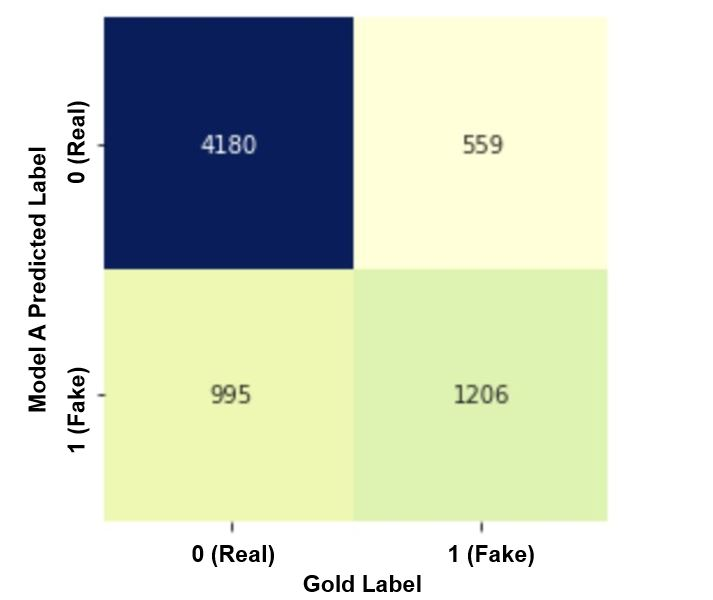

## Introduction

We have built a text classification system for predicting whether a news article is real or fake. 
To learn about our motivation for choosing to work on this kind of system and our longer term vision, please see our promotional [pitch](LINK to pitch).
This blog is aimed at our target user who is primarily someone who investigates whether news is fake but also anyone who reads the news and wants to quickly be able to paste is a story and get an indication whether it is fake.
Without going into details on the algorithms we have used, we provide an overview here of how we built our system and explain how we assess its performance. 
We believe that truth investigators would want to understand at this level of detail in order to have confidence to use our system's automatically generated truth assessment as a starting point or a way to prioritize their work.
For full details on the algorithms, please see our [technical report](link to technical report).

## We gathered data from our target users

Social media has fundamentally changed information, giving the public direct access to more information than ever before. 
But with the recent proliferation of low-quality or false content, it has become often nearly impossible to discern accurate information. 
This means that disinformation spreads further and faster online than it ever could before.
[Rand.org](www.rand.org), one of the [most influential](https://thebestschools.org/features/most-influential-think-tanks/) [think tanks](https://en.wikipedia.org/wiki/Think_tank), has compiled [a list of all the services that seek to ascertain the accuracy of information](https://www.rand.org/research/projects/truth-decay/fighting-disinformation/search.html#q=&typeOfTool=Verification).
There are fewer than 40 such services in the US, a country with [223 million social media users](https://www.statista.com/statistics/278409/number-of-social-network-users-in-the-united-states/). 
Of the services that assess text (some focus on photos and videos), the gross majority have fewer than 25 employees and do not employ any AI nor machine learning automation in the checking. 
  
We obtained gold labels for nearly 70000 articles from the three services which we perceived to be the most renouned (based only on our experience).
These articles were labeled as "fake" or "not fake" by [snopes.com](https://www.snopes.com/), [emergent.info](http://www.emergent.info/) or [politifact.com](https://www.politifact.com/).
Human-labeled instances which are presumed to be correct are referred to as "gold labels." 
#Include visualization(s) here of the 70000 articles (snopes or emergent or politifact and fake or not fake)
 

## Simple explanation of performance measures in natural language processing (NLP)

Below is a diagram called a ["confusion matrix"](https://en.wikipedia.org/wiki/Confusion_matrix).
A funny name, yes, but we hope the reason for it will become clear.
A confusion matrix presents in a table the fundamental measures of performance in NLP (and machine learning in general). 

To see the exact formula for calculating F1 based on accuracy and precision, please see our [technical report](link to technical report).  
Different measures from this list are important to different members of the NLP field.
For example, Facebook and Microsoft only report on the precision of their models when assessing an article as fake.

All images are included under [fair use](https://www.socialmediaexaminer.com/copyright-fair-use-and-how-it-works-for-online-images/).